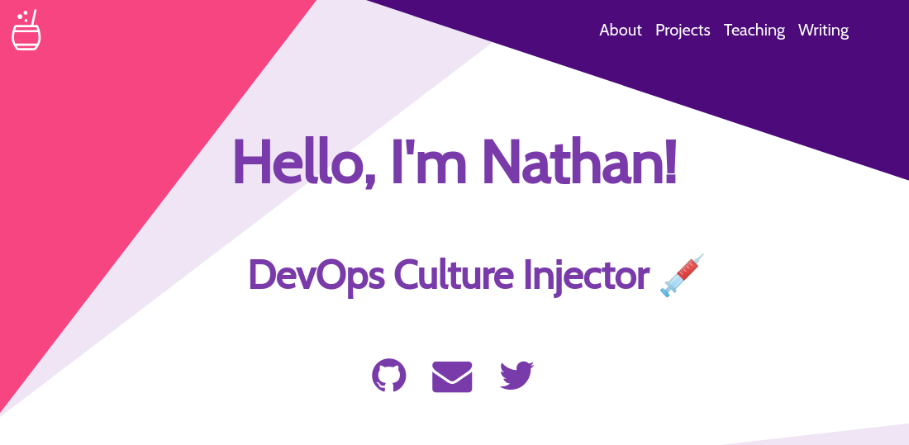

# Nathan Glover: Portfolio

A portfolio site for Nathan Glover on Gatsby integrated with Contentful CMS.



## How to start

If you never used Gatsby before, I highly recommend you to [Set up your development environment](https://www.gatsbyjs.org/tutorial/part-zero/)!

```bash
gatsby new nathanglover-gatsby-portfolio https://github.com/t04glovern/nathanglover-gatsby-portfolio
```

Create an empty space in [Contentful](https://www.contentful.com/)! After the space is created, run the following command:

```bash
npm run setup
```

This CLI will request 3 values:

- Space ID
- Content Delivery API - access token
- Personal Access Token

These 3 values are inside the `Settings section` > `API keys`.

After this step we can finally run the project and see the result in [http://localhost:8000/](http://localhost:8000/) 😃

```bash
npm run develop
```

## Building your site 📦

As we are dealing with environment variables, the `.env` file is excluded from `.gitignore` file. Therefore, in order to deploy the website you have to send `CONTENTFUL_SPACE_ID` and `CONTENTFUL_ACCESS_TOKEN` with the `build` command.

```bash
CONTENTFUL_SPACE_ID=xxxxx CONTENTFUL_ACCESS_TOKEN=yyyyy npm run build
```

The result will be stored inside the `public` folder, so you can upload to your webhost. I highly suggest using this starter with Netlify when you can define which command will build the project and also send the environment variables inside the website configuration.

### Push S3

```bash
aws s3 mb s3://nathanglover.com
aws s3 sync public/ s3://nathanglover.com --delete --acl public-read

aws cloudfront create-invalidation --distribution-id=$CLOUDFRONT_DIST_ID --paths "/*"
```

## Google Analytics (Optional) 📈

This starter has the analytics plugin inside the `gatsby-config`, so the only need to do in order to enable it is to provide the `Tracking Id` for your site (starts with `UA-`). Just set a new variable inside your `.env` file called `GOOGLE_ANALYTICS_ID` and analytics wil be turn on automatically 😄

## Attribution 📝

- [Gatsby Starter: Mate](https://github.com/EmaSuriano/gatsby-starter-mate)
